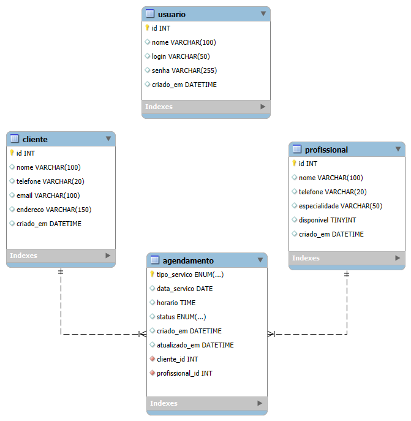

# Sistema de Agendamento de Faxinas — Documentação

## 1. Visão Geral

Sistema para gestão de agendamentos de serviços de faxina residencial e comercial, permitindo controlar clientes, profissionais e agendamentos, evitando conflitos de horário.

## 2. Lista de Requisitos Funcionais

| Código | Nome                        | Descrição                                                                                                                         |
| ------ | --------------------------- | --------------------------------------------------------------------------------------------------------------------------------- |
| RF01   | Login                       | O sistema deve permitir que o usuário realize login utilizando usuário e senha.                                                   |
| RF02   | Logout                      | O sistema deve permitir que o usuário encerre a sessão e retorne à tela de login.                                                 |
| RF03   | Cadastro de Clientes        | O sistema deve permitir cadastrar, editar, excluir e consultar clientes.                                                          |
| RF04   | Cadastro de Profissionais   | O sistema deve permitir cadastrar, editar, excluir e consultar profissionais de limpeza.                                          |
| RF05   | Cadastro de Agendamentos    | O sistema deve permitir cadastrar novos agendamentos de faxina.                                                                   |
| RF06   | Edição de Agendamentos      | O sistema deve permitir editar um agendamento existente.                                                                          |
| RF07   | Exclusão de Agendamentos    | O sistema deve permitir excluir um agendamento.                                                                                   |
| RF08   | Listagem de Agendamentos    | O sistema deve listar todos os agendamentos cadastrados.                                                                          |
| RF09   | Busca de Agendamentos       | O sistema deve permitir buscar agendamentos por cliente, profissional ou data.                                                    |
| RF10   | Controle de Conflitos       | O sistema deve verificar se já existe outro agendamento no mesmo horário para o mesmo profissional.                               |
| RF11   | Controle de Disponibilidade | O sistema deve impedir o agendamento de profissionais indisponíveis.                                                              |
| RF12   | Alertas                     | O sistema deve exibir alertas quando houver conflito de horários ou quando um agendamento estiver próximo de acontecer.           |
| RF13   | Histórico                   | O sistema deve registrar o histórico dos agendamentos, identificando cliente, profissional e data da operação.                    |
| RF14   | Validação de Dados          | O sistema deve validar os dados informados antes de salvar um agendamento.                                                        |
| RF15   | Interface Principal         | O sistema deve exibir o nome do usuário logado e permitir o acesso às telas de Cadastro de Agendamentos e Gestão de Agendamentos. |

---

## 3. Diagrama Entidade-Relacionamento



---

## 4. Tecnologias Utilizadas

- **Frontend:** React + Vite, React Router DOM, Tailwind CSS, Axios
- **Banco de Dados:** _MYSQL_, banco `faxina_db`

---

## 5. Como Executar o Frontend

```bash
cd frontend
npm install
npm run dev
```

---
